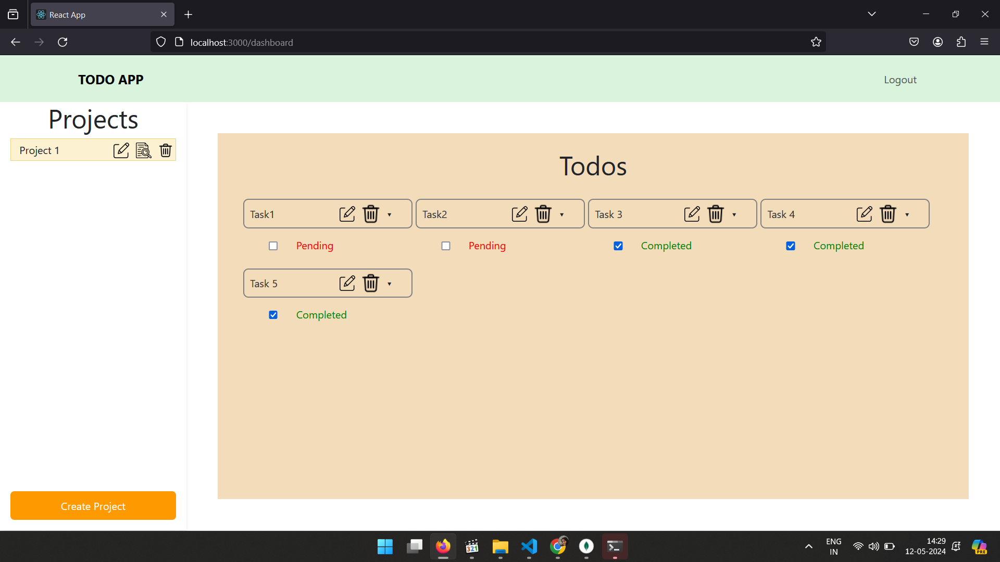

# Task Management Application

## Table of Contents
- [Description](#description)
- [Features](#features)
- [Technologies Used](#technologies-used)
- [Installation](#installation)
- [View](#view)
## Description
This project is a task management application that helps users organize their tasks and projects effectively. It provides a user-friendly interface for creating projects and adding todos (tasks) to each project. Users can update the status of todos as they progress and mark them as completed when done.

## Features

- Create, update, and delete projects
- Add, update, and delete todos within projects
- Mark todos as completed or pending
- Responsive design for seamless usage on desktop and mobile devices

## Technologies Used

### Frontend

- React.js
- React Router
- Axios

### Backend

- Node.js
- Express.js
- MongoDB
- Mongoose

## Installation

1. Clone the repository:

```bash
git clone https://github.com/naflaashraf/Todo-apps.git
```
2. Navigate to the project directory:

```bash
cd TodoProject
```
3. Install dependencies for frontend and backend:

```bash
cd client
npm install
cd ../server
npm install
```
4. To run the project

```bash
# to run the server
npm start

# to run the client
npm start
```

## View


